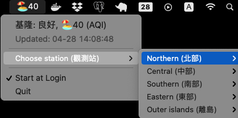

# tw-air-quality-app
air quality app of Taiwan on MacOS by Go



## Requirement
  * Go >= 1.13

## Download and Run it
```bash
$ wget https://github.com/grtfou/tw-air-quality-app/releases/download/v1.2/MyAirQ.tar.gz
$ tar zxvf MyAirQ.tar.gz
$ chmod +x MyAirQ.app
$ ./MyAirQ.app       # Or double click MyAirQ.app
```

## Build App and Run it
```bash
# build
$ GOOS=darwin GOARCH=amd64 go build -o MyAirQ.app air.go

# run
$ ./MyAirQ.app
```

## License
MIT license.
