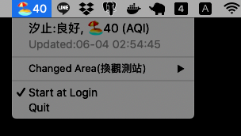

# tw-air-quality-app
Taiwan air quality MacOS App by Go



## Requirement
  * Go >= 1.13

## Build App and Run it
```bash
$ GOOS=darwin GOARCH=amd64 go build -o MyAirQ.app air.go
$ ./MyAirQ.app
```

## License
MIT license.
